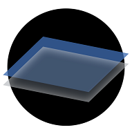

#Open-Jiritsu

Open-Jiritsu provides a flexible and modular platform to interface Jiritsu Client Fleets with Jiritsu Infrastructure Services.
Open-Jiritsu will be platform agnostic to iOS, Android, or Microsoft connected vehicle environments.

##Overview

* [Using Open-Jiritsu](documentation/using-openjiritsu.md)    
* [Integrate Your Code](documentation/code-integration.md)  

##Collaboration in Automotive

* [Partnerships](documentation/partnerships.md)

##Guides

* [Machine Booting](documentation/machine-booting.md)  
* [Interface Process](documentation/interface-process.md)  
* [Jiritsu-Config](documentation/jiritsu-config.md)  
* [Open-Jiritsu Tools](documentation/openjiritsu-tools.md)   

